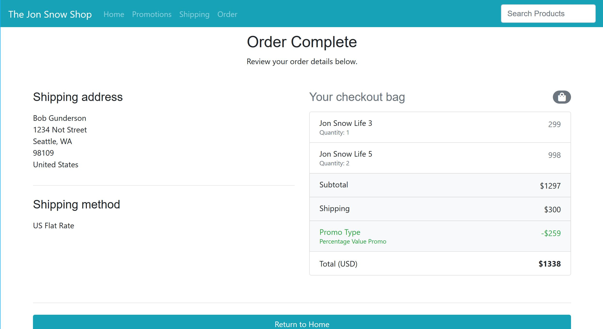

# The Jon Snow Shop
Web application created for RAM Mounting Systems front end assessment. 

[Deployment link on Azure](https://jonsnowstore.azurewebsites.net/)

**Author**: Earl Jay Caoile  
**Version**: 1.0.0

## Overview
This web application serves as a demonstration of front end web 
development skills by grabbing API data and displaying it on a page.

## Getting Started
The following is required to run the program.
1. Visual Studio or a similar program capable of running ASP.NET Core applications.
2. An internet connection.
3. A web browser to view the contents.

## Visuals
  
  
  
  
  

## Architecture
*Languages*: HTML, CSS, JavaScript, C#  
*Libraries and Frameworks*: ASP.NET Core (Razor Pages), Bootstrap, jQuery, Font Awesome  
*Type of Application*: Web Application    
NOTE: rather than using the popular MVC model, Razor Pages combines the controller 
and views into one big file contaiing two smaller files.  

## References
- [Bootstrap CDN](https://www.bootstrapcdn.com/)
- [Bootstrap Documentation](https://getbootstrap.com/docs/4.1/getting-started/introduction/)
- [research on how to change menu item on nav item click](https://stackoverflow.com/questions/41660461/add-active-class-to-section-of-menu)
- [dynamically rendering multiple rows depending on list count](https://www.jerriepelser.com/blog/approaches-when-rendering-list-using-bootstrap-grid-system/)
- [research on how to always keep footer at the bottom](https://css-tricks.com/couple-takes-sticky-footer/)